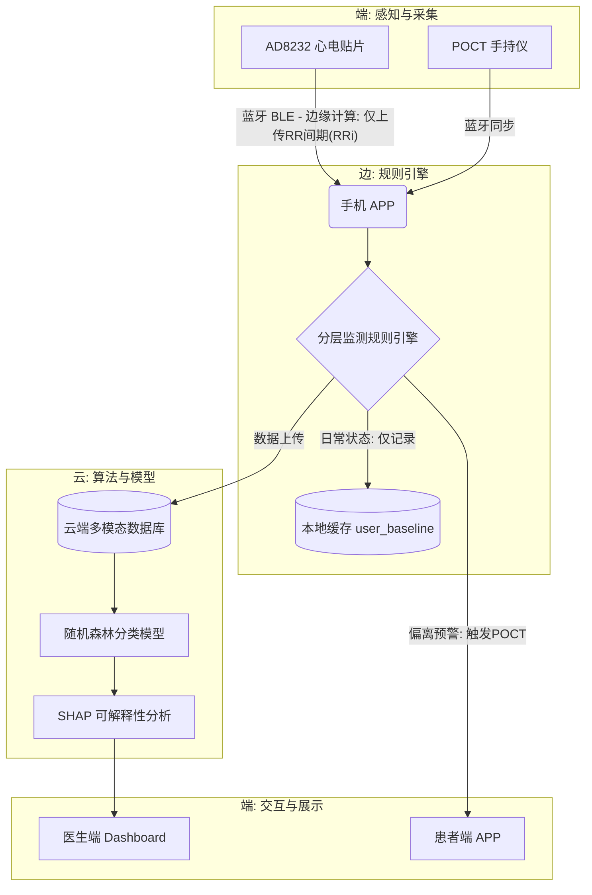

# BD-Multimodal-Assist
基于肠-脑轴的双相情感障碍多模态辅助诊断系统

## 🏗️ 系统架构与数据流图

```mermaid
graph TD
    subgraph 感知层 [端: 感知与采集]
        A[AD8232 心电贴片]
        C[POCT 手持仪]
    end

    subgraph 边缘层 [边: 规则引擎]
        B(手机 APP)
        D{分层监测规则引擎}
        E[(本地缓存 user_baseline)]
    end

    subgraph 云端大脑 [云: 算法与模型]
        G[(云端多模态数据库)]
        H[随机森林分类模型]
        I[SHAP 可解释性分析]
    end

    subgraph 应用层 [端: 交互与展示]
        J[医生端 Dashboard]
        K[患者端 APP]
    end

    %% 连线与标注 (注意：包含特殊字符的标签必须用双引号包裹)
    A -->|"蓝牙 BLE - 边缘计算: 仅上传RR间期(RRi)"| B
    C -->|"蓝牙同步"| B
    B --> D
    D -->|"日常状态: 仅记录"| E
    D -->|"偏离预警: 触发POCT"| K
    D -->|"数据上传"| G
    G --> H
    H --> I
    I --> J
```
